# 300DaysOfDeepLearning-NLP-GenAI
This is my 300 days of journey from Deep Learning to Generative AI !!

___
## Syllabus to cover

| **S.N.** | **Books and Lessons (Resources)**                                                                                         | **Status** |
|----------|---------------------------------------------------------------------------------------------------------------------------|------------| 
| **1.**   | [**Hands-On Machine Learning with Scikit-Learn, Keras, and TensorFlow (Part-II)**](https://github.com/ageron/handson-ml3) | ⏳          |
| **2.**   | [**Deep Learning Specialization**](https://www.coursera.org/specializations/deep-learning)                                | ⏳          |
| **3.**   | [**NLP Specialization**](https://www.coursera.org/specializations/natural-language-processing)                            | ⏳          |  
| **4.**   | [**LLM-Course Repo**](https://github.com/mlabonne/llm-course/tree/main)                                                   | ⏳          |

## Research Papers

| **S.N.** | **Papers**                                                                                          | 
|----------|-----------------------------------------------------------------------------------------------------|
| **1.**   | [**Learning representations by back-propagating errors**](https://www.nature.com/articles/323533a0) |        

## Projects

| **S.N.** | **Project Title** | **Status** |
|----------|-------------------|------------|
| 1.       |                   |            |

___

## Day 1

While I had started the **Deep Learning Specialization** few days ago, today I completed the first course of the specialization
**Neural Networks and Deep Learning**. With this confidence being alive, I thought to start my challenge. 
In the course, the specific focus was on the **vectorization** technique that has saved
a lot of time while executing **Neural Networks**. Also, the concept of **Broadcasting** in Python, **Activation Function**, **Cost Function** and 
**Gradient Descent** was provided which was kind of revision to me. Learnt about the mathematics behind **Forward Propagation** & 
**Backward Propagation** through the course. Also took the help of classic research paper [**Learning representations by back-propagating errors**](https://www.nature.com/articles/323533a0)
to understand back-propagation stuffs.

- Some slides snippets from the course are provided below :    
  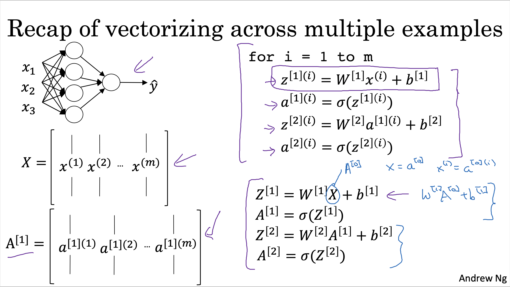     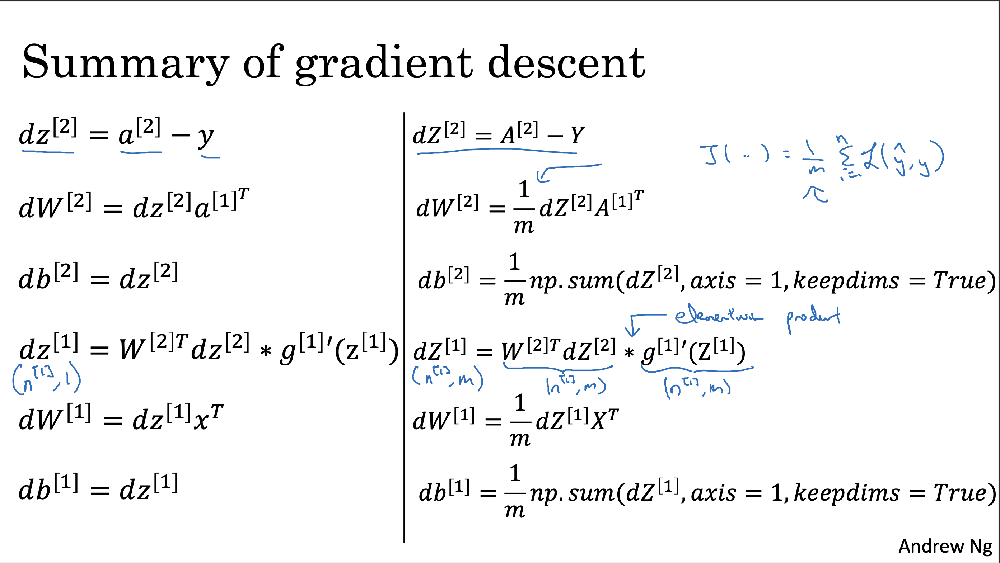    
  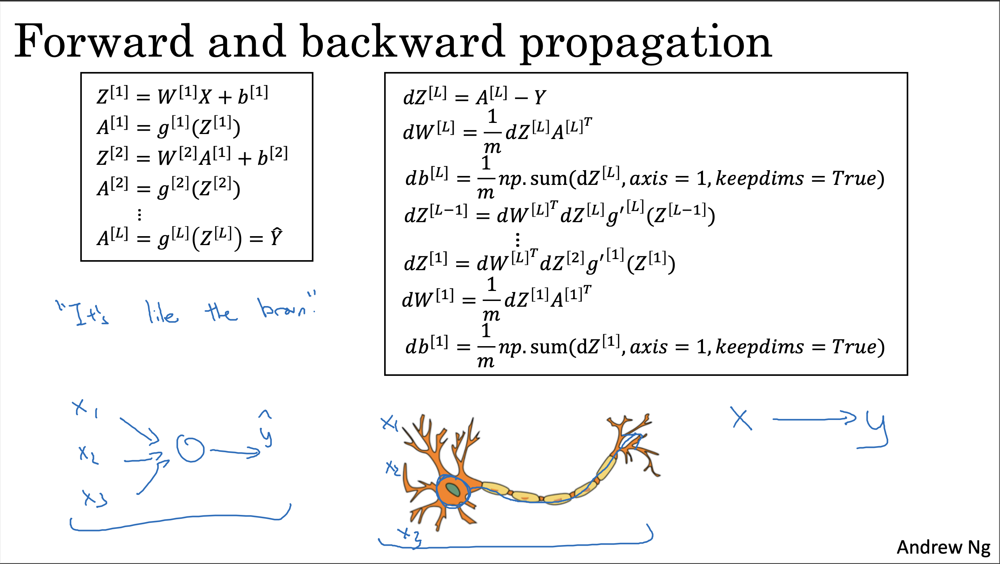

___

## Day 2

Started the next course in the same specialization. The title of the course is **Improving Deep Neural Networks: Hyperparameter tuning, Regularization and Optimization**.
Today I completed the Week 1 of the course. The course consists of the topics like **Train/dev/test sets**, **Bias and Variance**,
 **Regularization** with techniques like **L2 regularization** and **Dropout regularization**. The rest of the contents were
about dealing with **vanishing/exploding gradients** with **Random Initialization** of weights and **Gradient Check**. 

Some slides snippets from the course are provided below :    
 
- **Bias And Variance :** **Bias** refers to the error due to overly simplistic assumptions in the model, causing it to underfit the data.
**Variance** refers to the error due to the model being too sensitive to small fluctuations in the training data, leading to overfitting.
    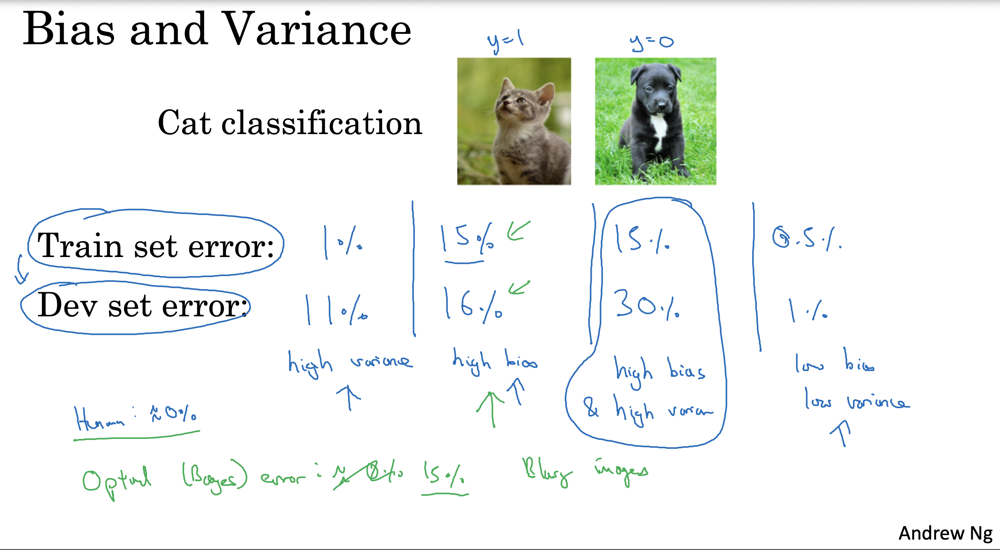    
- **Dropout Regularization :**  **Dropout regularization** randomly deactivates a fraction of neurons during training to prevent overfitting by
forcing the network to learn more robust features.     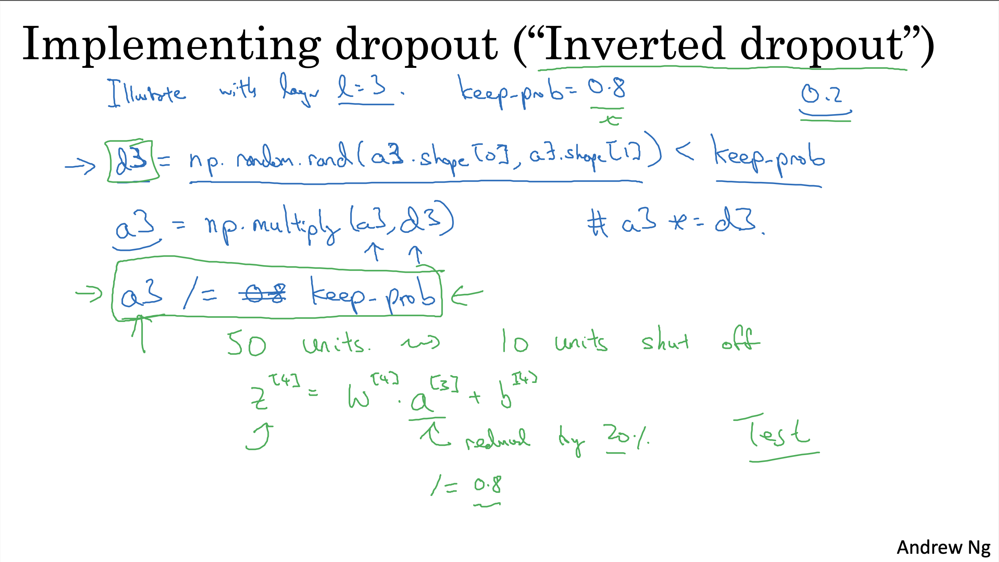    
- **Gradient Check :** **Gradient check** is a process to verify the correctness of computed gradients by comparing them with numerically approximated gradients.
It is done to ensure that backpropagation is implemented correctly, helping identify bugs in the gradient computation.     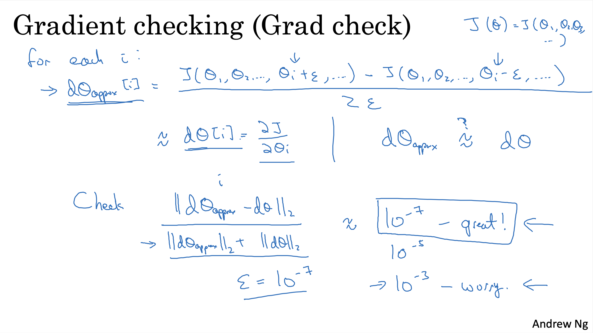

___

## Day 3

Completed the week 2 of the course that I started yesterday. The week was about **Optimization Alogrithms**. This includes the topics like
**Mini-Batch Gradient Descent**, **Gradient Descent With Momentum**, **RMSprop**, **Adam Optimization Algorithm** and **Learning Rate Decay**.
   
Putting my understanding on brief with snippets from course slides as follows :    

- **Mini-Batch Gradient Descent :** **Mini-batch gradient descent** updates model parameters by computing gradients on small, random subsets (mini-batches)
of the training data, combining the benefits of both **batch** (size = m) and **stochastic** (size = 1) gradient descent. It strikes a balance between fast convergence and stable optimization,
making it well-suited for large datasets and neural networks.     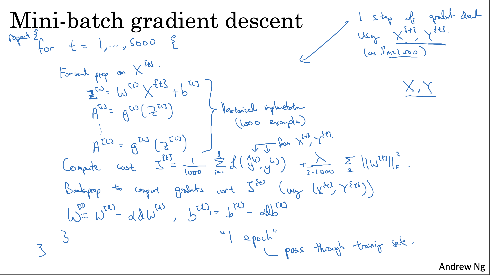    
- **Gradient Descent With Momentum :** It enhances optimization by accumulating a velocity term (**exponentially weighted average** of past gradients) to maintain
direction, reducing oscillations and speeding up convergence, especially in regions with high curvature.     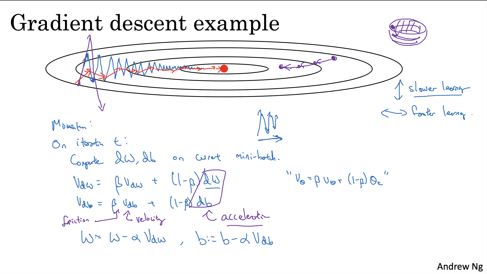    
- **RMSprop :** **RMSprop** adapts the learning rate for each parameter by dividing the gradient by the square root of an exponentially weighted average of past squared gradients, 
helping the optimization converge faster and avoid oscillations, especially in non-convex problems.     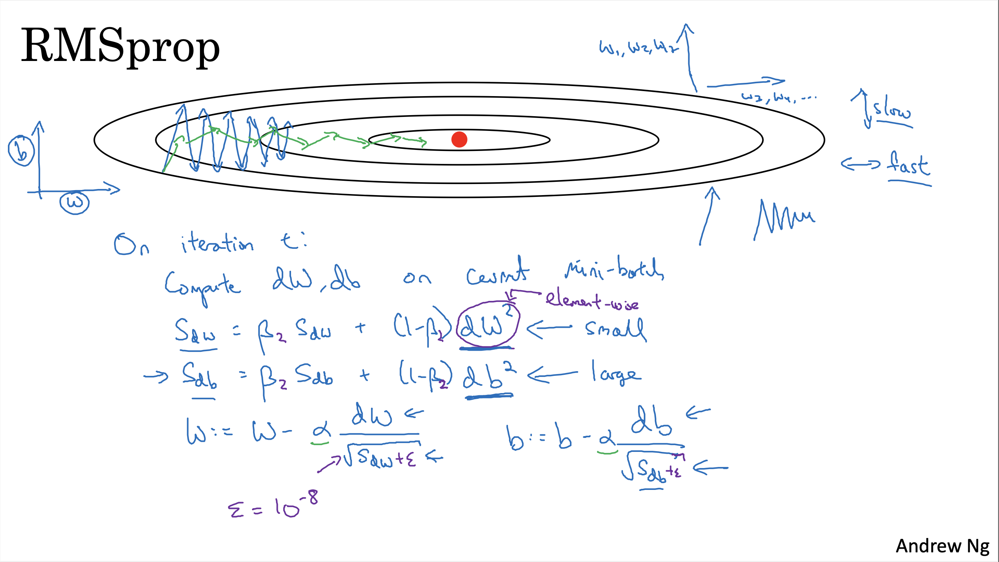    
- **Adam Optimization Algorithm :** It combines the benefits of **Momentum** and **RMSprop** by maintaining both an exponentially weighted average of 
past gradients (like Momentum) and past squared gradients (like RMSprop) to adapt the learning rate for each parameter. This dual mechanism helps Adam achieve faster
convergence with smoother updates, making it well-suited for complex, non-convex problems.     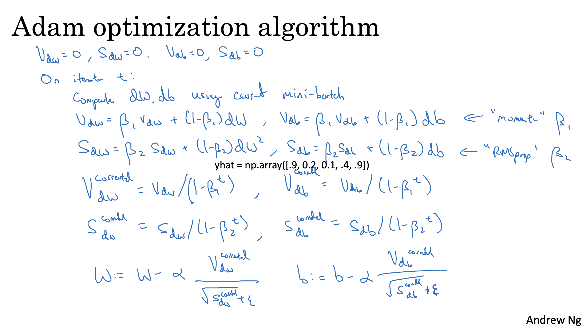    
- **Learning Rate Decay :** **Learning rate decay** reduces the learning rate progressively during training to ensure faster initial convergence and finer adjustments in later stages, 
preventing the model from overshooting the optimal solution. It improves stability by starting with larger updates and gradually decreasing the step size as the model approaches the minimum.

___

## Day 4

Completed the another course from the specialization : **Improving Deep Neural Networks: Hyperparameter tuning, Regularization and Optimization**.
The remaining portion was about the **Hyperparameter Tuning**, **Batch Normalization**, **Softmax Regression** and **Tensorflow Introduction**. 
   
Putting my understanding on brief with snippets from course slides as follows :    

- **Hyper-parameter Tuning :** It is the process of optimizing predefined settings like learning rate, batch size, and architecture 
to improve model performance. It involves techniques such as grid search or random search to efficiently explore the hyperparameter space.    
- **Batch Normalization :** It is a technique that normalizes activations of each layer within a mini-batch, ensuring stable distributions 
throughout training. It speeds up convergence, reduces internal covariate shift, and helps mitigate issues like vanishing or exploding gradients.
    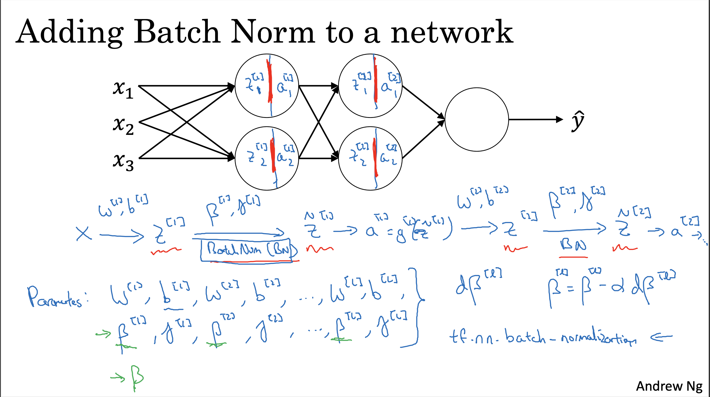
- **Softmax Regression :** It is a generalization of logistic regression that predicts probabilities across multiple classes by applying the softmax function to convert 
logits into a probability distribution.     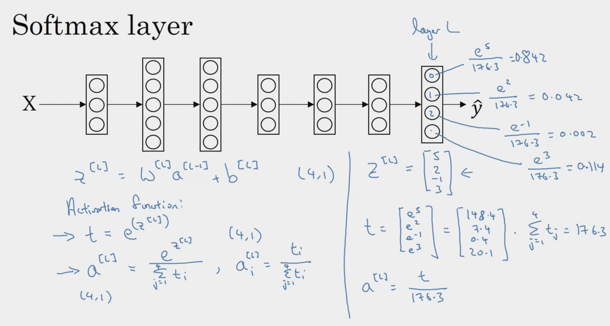    
- **Basic Tensorflow Introduction :** It is an open-source machine learning framework developed by Google that facilitates building, training, and deploying machine l
earning and deep learning models across various platforms.     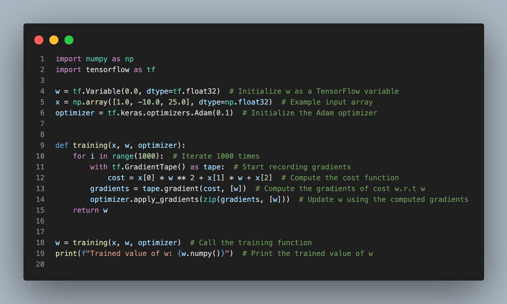

___

## Day 5

Today I completed the next course from the specialization : **Structuring Machine Learning Projects**. In this course I learnt to diagnose errors in a machine learning system; 
prioritize strategies for reducing errors; understand complex ML settings, such as **mismatched training/test sets**, and **comparing to and/or surpassing human-level performance**; and apply 
**end-to-end learning**, **transfer learning**, and **multi-task learning**.    

Putting simple understanding with snippets from course slides as follows :

- **Mismatched training/test sets :** This occurs when the data distributions of the two sets differ significantly, leading to biased or misleading evaluation
results. This can result in overestimated model performance during training, as the model may not generalize well to the test set due to variations in features,
contexts, or conditions not present in the training data.     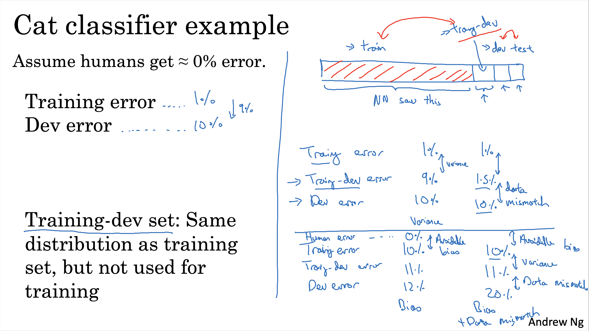    
- **End-to-end Learning :** It is a machine learning approach where the entire process from input to output is modeled as a single system, allowing the algorithm
to automatically learn all the necessary features and transformations directly from the raw data without the need for manual feature extraction. 
     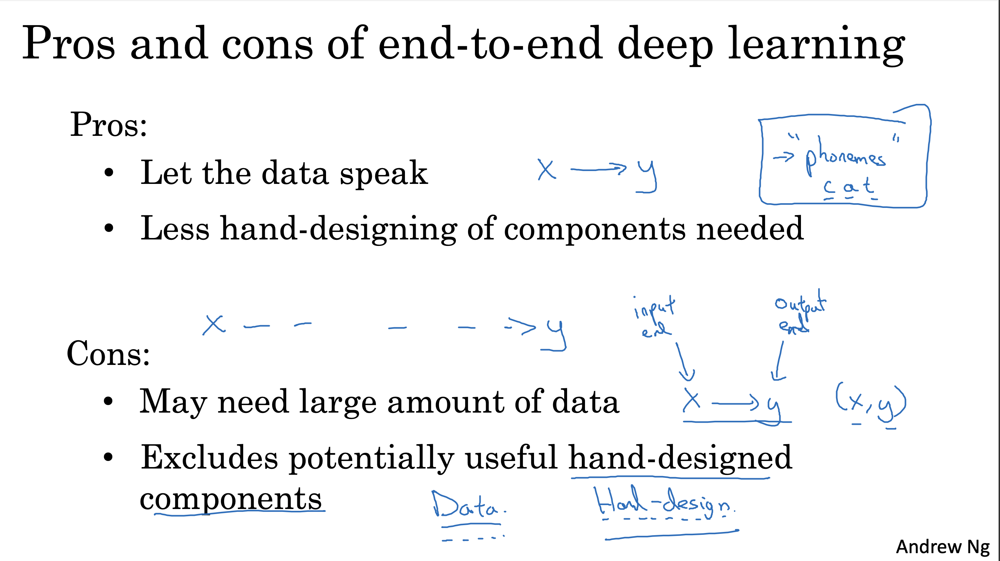    
- **Transfer Learning :** It is a technique where a model pre-trained on one task or dataset is fine-tuned on a different but related task, 
leveraging prior knowledge to improve performance and reduce training time.     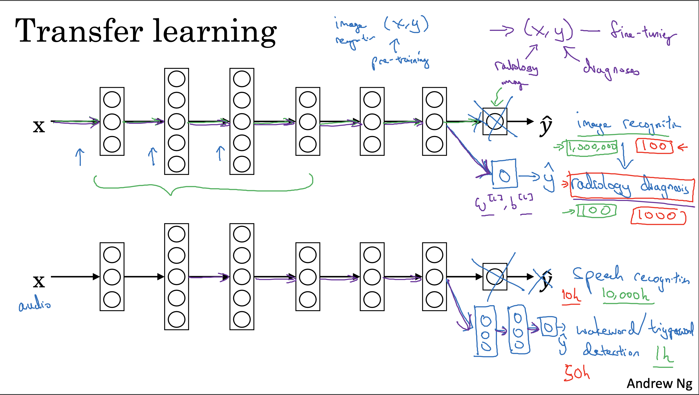    
- **Multi-task learning :** It is an approach where a model is trained simultaneously on multiple related tasks, allowing it to leverage shared 
information across tasks to improve generalization and performance.     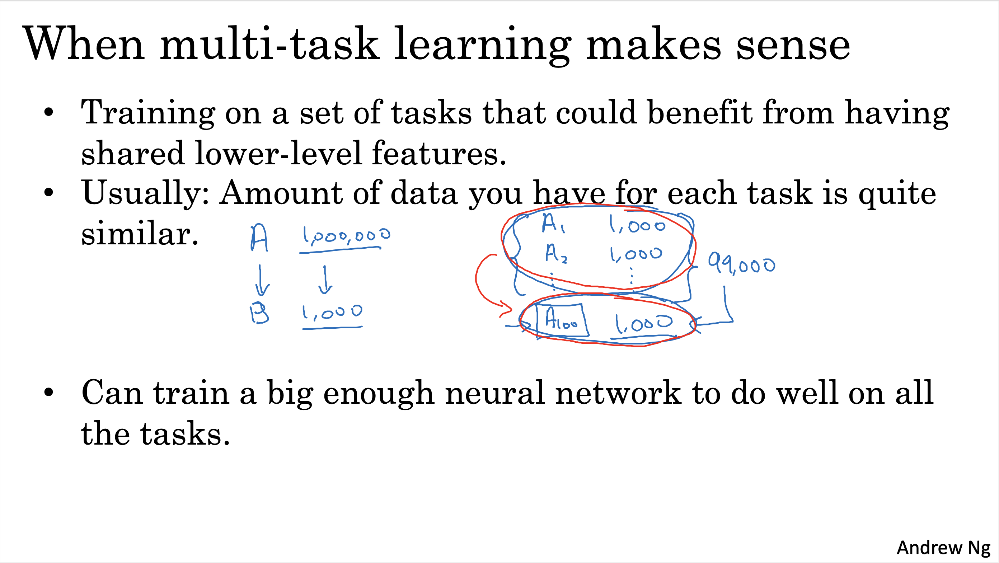 

___

## Day 6

Today I started the next course from the specialization : **Convolutional Neural Networks**. I just had understanding on
the **Edge Detection** and **Padding**.    

Putting my understanding along with snippets from the course slides as follows :    

- **Edge Detection :** It the process of identifying the boundaries or outlines of objects in an image. It helps in extracting 
structural information, which is crucial for object detection, segmentation, and other computer vision tasks.     
   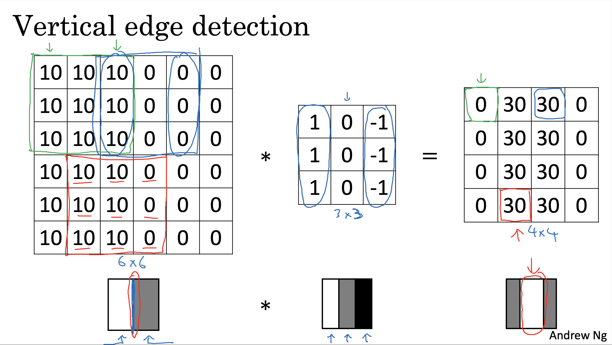     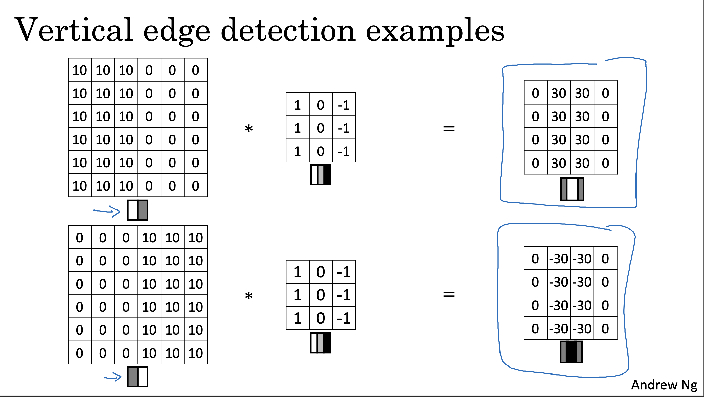    
- **Padding :** It refers to adding extra pixels (usually zeros) around the input image to control the spatial dimensions of the output 
feature map. It helps preserve more information at the edges and ensures the output size remains consistent, especially with multiple convolutional layers.
     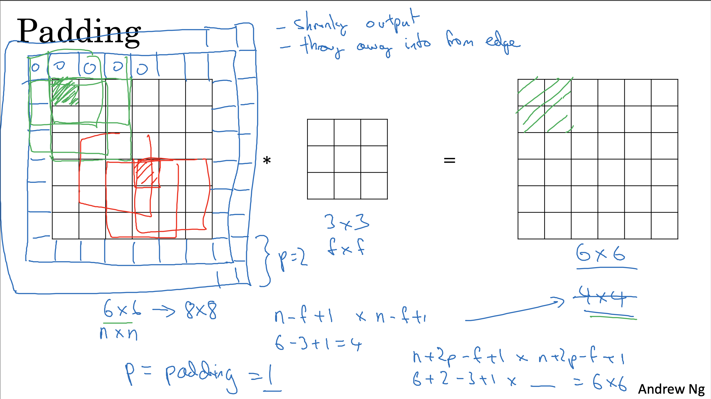     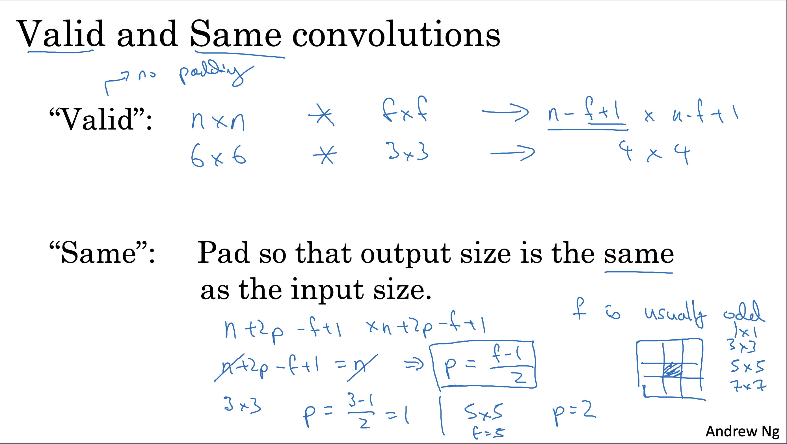    

___
