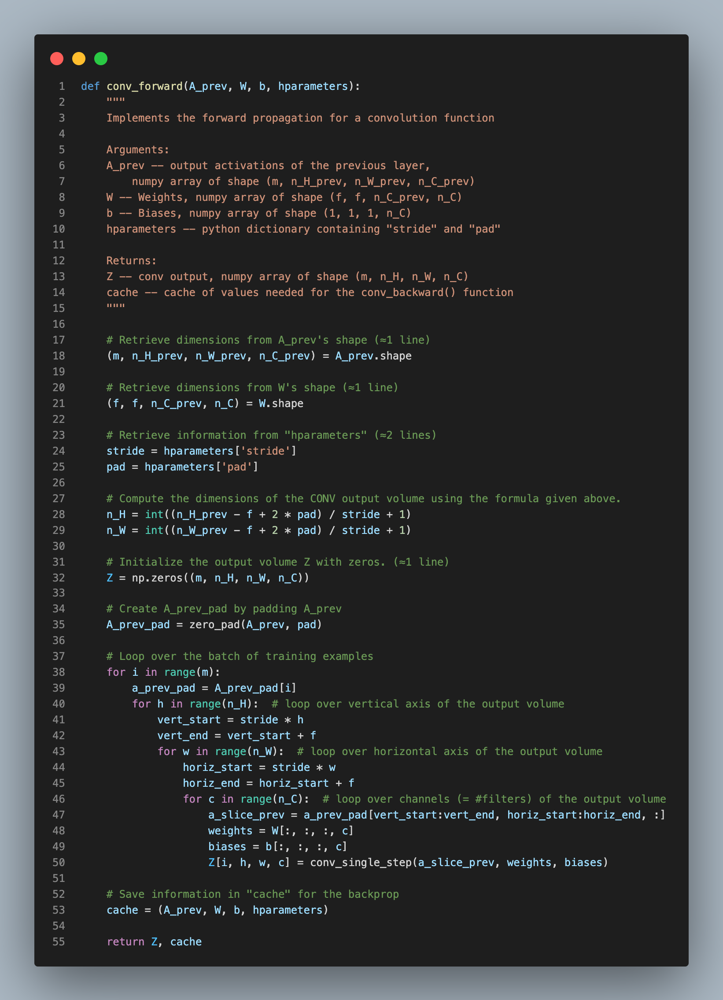
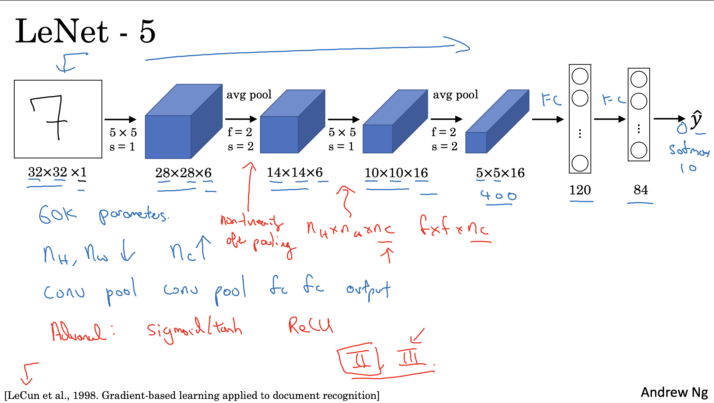
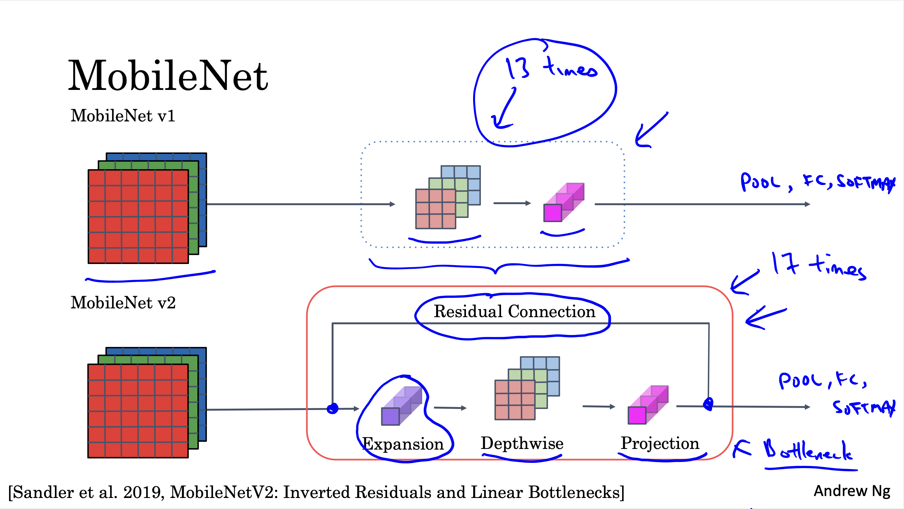
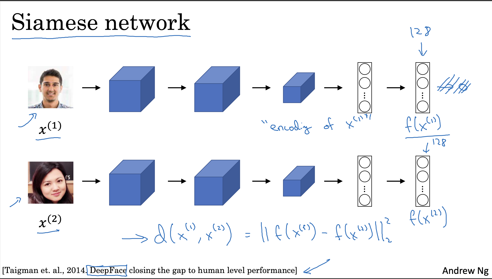
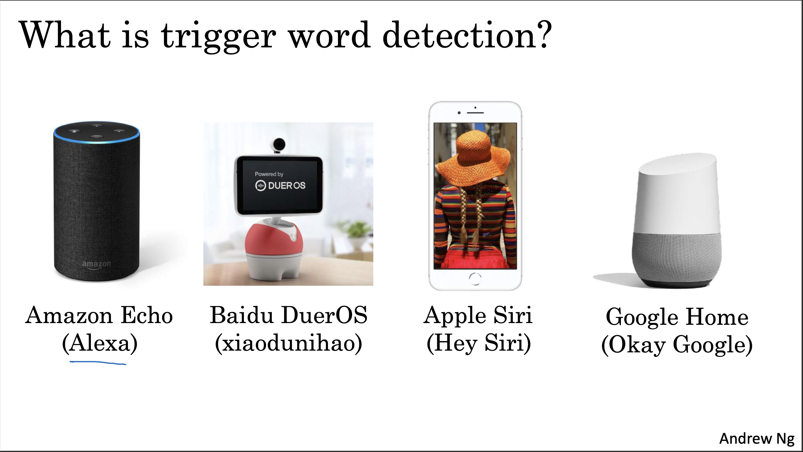

# 300DaysOfDeepLearning-NLP-GenAI
This is my 300 days of journey from Deep Learning to Generative AI !!

___
## Syllabus to cover

| **S.N.** | **Books and Lessons (Resources)**                                                                                         | **Status** |
|----------|---------------------------------------------------------------------------------------------------------------------------|------------| 
| **1.**   | [**Hands-On Machine Learning with Scikit-Learn, Keras, and TensorFlow (Part-II)**](https://github.com/ageron/handson-ml3) | ⏳          |
| **2.**   | [**Deep Learning Specialization**](https://www.coursera.org/specializations/deep-learning)                                | ✅          |
| **3.**   | [**NLP Specialization**](https://www.coursera.org/specializations/natural-language-processing)                            | ⏳          |  
| **4.**   | [**LLM-Course Repo**](https://github.com/mlabonne/llm-course/tree/main)                                                   | ⏳          |

## Research Papers

| **S.N.** | **Papers**                                                                                                                                                                   | 
|----------|------------------------------------------------------------------------------------------------------------------------------------------------------------------------------|
| **1.**   | [**Learning representations by back-propagating errors**](https://www.nature.com/articles/323533a0)                                                                          |
| **2.**   | [**ImageNet Classification with Deep Convolutional Neural Networks**](https://proceedings.neurips.cc/paper_files/paper/2012/file/c399862d3b9d6b76c8436e924a68c45b-Paper.pdf) |
| **3.**   | [**You Only Look Once: Unified, Real-Time Object Detection**](https://arxiv.org/abs/1506.02640)                                                                              |

## Projects

| **S.N.** | **Project Title** | **Status** |
|----------|-------------------|------------|
| 1.       |                   |            |

___

## Day 1

While I had started the **Deep Learning Specialization** few days ago, today I completed the first course of the specialization
**Neural Networks and Deep Learning**. With this confidence being alive, I thought to start my challenge. 
In the course, the specific focus was on the **vectorization** technique that has saved
a lot of time while executing **Neural Networks**. Also, the concept of **Broadcasting** in Python, **Activation Function**, **Cost Function** and 
**Gradient Descent** was provided which was kind of revision to me. Learnt about the mathematics behind **Forward Propagation** & 
**Backward Propagation** through the course. Also took the help of classic research paper [**Learning representations by back-propagating errors**](https://www.nature.com/articles/323533a0)
to understand back-propagation stuffs.

- Some slides snippets from the course are provided below :    
           
  

___

## Day 2

Started the next course in the same specialization. The title of the course is **Improving Deep Neural Networks: Hyperparameter tuning, Regularization and Optimization**.
Today I completed the Week 1 of the course. The course consists of the topics like **Train/dev/test sets**, **Bias and Variance**,
 **Regularization** with techniques like **L2 regularization** and **Dropout regularization**. The rest of the contents were
about dealing with **vanishing/exploding gradients** with **Random Initialization** of weights and **Gradient Check**. 

Some slides snippets from the course are provided below :    
 
- **Bias And Variance :** **Bias** refers to the error due to overly simplistic assumptions in the model, causing it to underfit the data.
**Variance** refers to the error due to the model being too sensitive to small fluctuations in the training data, leading to overfitting.
        
- **Dropout Regularization :**  **Dropout regularization** randomly deactivates a fraction of neurons during training to prevent overfitting by
forcing the network to learn more robust features.         
- **Gradient Check :** **Gradient check** is a process to verify the correctness of computed gradients by comparing them with numerically approximated gradients.
It is done to ensure that backpropagation is implemented correctly, helping identify bugs in the gradient computation.     

___

## Day 3

Completed the week 2 of the course that I started yesterday. The week was about **Optimization Alogrithms**. This includes the topics like
**Mini-Batch Gradient Descent**, **Gradient Descent With Momentum**, **RMSprop**, **Adam Optimization Algorithm** and **Learning Rate Decay**.
   
Putting my understanding on brief with snippets from course slides as follows :    

- **Mini-Batch Gradient Descent :** **Mini-batch gradient descent** updates model parameters by computing gradients on small, random subsets (mini-batches)
of the training data, combining the benefits of both **batch** (size = m) and **stochastic** (size = 1) gradient descent. It strikes a balance between fast convergence and stable optimization,
making it well-suited for large datasets and neural networks.         
- **Gradient Descent With Momentum :** It enhances optimization by accumulating a velocity term (**exponentially weighted average** of past gradients) to maintain
direction, reducing oscillations and speeding up convergence, especially in regions with high curvature.         
- **RMSprop :** **RMSprop** adapts the learning rate for each parameter by dividing the gradient by the square root of an exponentially weighted average of past squared gradients, 
helping the optimization converge faster and avoid oscillations, especially in non-convex problems.         
- **Adam Optimization Algorithm :** It combines the benefits of **Momentum** and **RMSprop** by maintaining both an exponentially weighted average of 
past gradients (like Momentum) and past squared gradients (like RMSprop) to adapt the learning rate for each parameter. This dual mechanism helps Adam achieve faster
convergence with smoother updates, making it well-suited for complex, non-convex problems.         
- **Learning Rate Decay :** **Learning rate decay** reduces the learning rate progressively during training to ensure faster initial convergence and finer adjustments in later stages, 
preventing the model from overshooting the optimal solution. It improves stability by starting with larger updates and gradually decreasing the step size as the model approaches the minimum.

___

## Day 4

Completed the another course from the specialization : **Improving Deep Neural Networks: Hyperparameter tuning, Regularization and Optimization**.
The remaining portion was about the **Hyperparameter Tuning**, **Batch Normalization**, **Softmax Regression** and **Tensorflow Introduction**. 
   
Putting my understanding on brief with snippets from course slides as follows :    

- **Hyper-parameter Tuning :** It is the process of optimizing predefined settings like learning rate, batch size, and architecture 
to improve model performance. It involves techniques such as grid search or random search to efficiently explore the hyperparameter space.    
- **Batch Normalization :** It is a technique that normalizes activations of each layer within a mini-batch, ensuring stable distributions 
throughout training. It speeds up convergence, reduces internal covariate shift, and helps mitigate issues like vanishing or exploding gradients.
    
- **Softmax Regression :** It is a generalization of logistic regression that predicts probabilities across multiple classes by applying the softmax function to convert 
logits into a probability distribution.         
- **Basic Tensorflow Introduction :** It is an open-source machine learning framework developed by Google that facilitates building, training, and deploying machine l
earning and deep learning models across various platforms.     

___

## Day 5

Today I completed the next course from the specialization : **Structuring Machine Learning Projects**. In this course I learnt to diagnose errors in a machine learning system; 
prioritize strategies for reducing errors; understand complex ML settings, such as **mismatched training/test sets**, and **comparing to and/or surpassing human-level performance**; and apply 
**end-to-end learning**, **transfer learning**, and **multi-task learning**.    

Putting simple understanding with snippets from course slides as follows :

- **Mismatched training/test sets :** This occurs when the data distributions of the two sets differ significantly, leading to biased or misleading evaluation
results. This can result in overestimated model performance during training, as the model may not generalize well to the test set due to variations in features,
contexts, or conditions not present in the training data.         
- **End-to-end Learning :** It is a machine learning approach where the entire process from input to output is modeled as a single system, allowing the algorithm
to automatically learn all the necessary features and transformations directly from the raw data without the need for manual feature extraction. 
         
- **Transfer Learning :** It is a technique where a model pre-trained on one task or dataset is fine-tuned on a different but related task, 
leveraging prior knowledge to improve performance and reduce training time.         
- **Multi-task learning :** It is an approach where a model is trained simultaneously on multiple related tasks, allowing it to leverage shared 
information across tasks to improve generalization and performance.      

___

## Day 6

Today I started the next course from the specialization : **Convolutional Neural Networks**. I just had understanding on
the **Edge Detection** and **Padding**.    

Putting my understanding along with snippets from the course slides as follows :    

- **Edge Detection :** It the process of identifying the boundaries or outlines of objects in an image. It helps in extracting 
structural information, which is crucial for object detection, segmentation, and other computer vision tasks.     
            
- **Padding :** It refers to adding extra pixels (usually zeros) around the input image to control the spatial dimensions of the output 
feature map. It helps preserve more information at the edges and ensures the output size remains consistent, especially with multiple convolutional layers.
              

___

## Day 7

Dived deeper into the **CNN**. Putting understandings on various topics with snippets from course slides as follows : 

- **Strided Convolutions :** It refers to convolution operations where the filter moves across the input with a specified step size (stride),
which can be 1 or greater, determining how much the filter shifts between applications; when the stride is greater than 1, the operation
performs both convolution and downsampling by reducing the spatial dimensions of the output.         
- **Convolutions on RGB Image :** While we were observing the grayscale images preivously, got to know convolutions on RGB image.    
        
- **Types of layer in convolutions :**   1. **Convolution (CONV)**          2. **Pooling**
       i. **Max pooling** is a down sampling operation that extracts the maximum value from each region of the input, reducing spatial dimensions while retaining important features.
             ii. **Average Pooling** Average pooling is a downsampling operation that reduces spatial dimensions
    by computing the average value from each region of the input.          3. **Fully Connected** 
    connects every neuron from the previous layer to every neuron in the current layer, learning global patterns across the entire input.    
    Representing every layers in one neural network :         

___

## Day 8

Today I implemented **convolutional Neural Networks : Forward Pass** step by step. Attaching the snippets below :    

-            
            
 
___

## Day 9

Today I studied about **Classic Networks :** **LeNet-5**, **AlexNet** and **VGG-16**.     Putting my understanding with snippets from course slides as follows :    

- **LeNet-5 :** It is one of the first neural networks for recognizing images, created to help computers read handwritten numbers. It uses layers that first
find small patterns in images and then combine them to understand bigger details, allowing it to recognize numbers accurately.    
        
- **AlexNet :** It is a deep convolutional neural network developed by **Alex Krizhevsky** in 2012, designed to improve image classification accuracy with a much larger and 
more complex architecture than earlier models like LeNet. It has multiple layers of convolution, pooling, and fully connected layers, using ReLU activation and dropout to 
handle larger datasets, which led to a breakthrough in image recognition on the ImageNet dataset.         
- **VGG-16 :** It is a deep convolutional neural network developed by the **Visual Geometry Group (VGG)** that uses a straightforward 
architecture with **16 layers** to achieve high performance in image classification tasks. Its design relies on stacking small 3x3 
convolutional filters and pooling layers, which allows it to capture fine details in images and deliver powerful, accurate image recognition.
    

___

## Day 10

Today I studied about **ResNet** and **1 X 1 Convolution** and also went through the paper on **AlexNet** : [**ImageNet Classification with Deep Convolutional Neural Networks**](https://proceedings.neurips.cc/paper_files/paper/2012/file/c399862d3b9d6b76c8436e924a68c45b-Paper.pdf).
Will discuss the paper after finishing it. For today, let's discuss the following :    

- **ResNet :** ResNet is a deep neural network that uses **residual blocks** to make training very deep networks easier and more effective.
Each residual block has a shortcut connection, allowing the input to skip over intermediate layers and be added to the output, which helps
prevent issues like vanishing gradients. This structure lets ResNet learn small improvements (residuals) over the original input, making 
it more efficient at learning complex features without getting "stuck" as the network depth increases.         
        
- **1 X 1 Convolution :** A **1x1 convolutional layer** applies a filter of size 1 X 1, allowing it to process each pixel individually while combining 
information from different channels. This layer is highly efficient for **reducing or expanding depth** (channel size) and **recomputing feature 
representations** without altering the spatial dimensions, making it useful for computational efficiency and richer feature learning.
            

___

## Day 11

I studied about **Inception Network**, **MobileNet**, **EfficientNet** and got practical advices for using **ConvNets**.    

Putting my understanding with some slide snippets from the course as follows :    

- **Inception Network :** It is a deep convolutional neural network architecture designed to achieve high accuracy with efficient
computation by combining multiple filter sizes at each layer to capture a range of feature scales. Its core building block,
the **Inception module**, integrates parallel convolution operations of different filter sizes within a single layer, allowing the
network to process features at various scales simultaneously. Together, the Inception modules enable the Inception network to 
improve performance without drastically increasing computational costs.         
         
- **MobileNet :** It is a lightweight convolutional neural network that achieves computational efficiency by using **depthwise separable convolutions**
instead of standard convolutions throughout its layers. In this structure, **the depthwise convolution** applies a single filter per input channel to capture 
spatial information, followed by a **pointwise convolution** to combine these channels, drastically reducing the number of parameters and computations required.
                 
- **EfficientNet :** It is a family of convolutional neural networks that achieves high accuracy and efficiency by uniformly scaling 
network depth, width, and resolution using a compound scaling method.         

___

## Day 12

I completed the **Convolutional Neural Networks (CNN)** course from the **Deep Learning Specialization**. The remaining 
contents were about **YOLO**, **U-Net**, **Face Verification & Recognition** and **Neural Style Transfer**.
   

Sharing some slide snippets from the course :    

 -     
 -     
 -     
 -     
 -     

Additional to these, I also read the research paper : [**You Only Look Once: Unified, Real-Time Object Detection**](https://arxiv.org/abs/1506.02640)

___

## Day 13

Today I started the next course from the **Deep Learning Specialization** and that is **Sequence Models.** Today I just got
introduced with the **Sequence Models**, **Notations** and **Forward Propagation in RNN (Recurrent Neural Networks)**. 
   
Putting my understanding and snaps from course notes as follows :    

- **Sequence Models :** Sequence models are machine learning models designed to process sequential data, such as time series,
text, or audio, by capturing dependencies between elements across time or position.    
       
- **Recurrent Neural Networks :** Recurrent Neural Networks (RNNs) are a type of neural network made for handling sequences 
of data, like sentences or time series, by remembering information from earlier steps as they process the sequence. They are 
good at tasks like predicting the next word in a sentence but can struggle with remembering things over long sequences.    
             

___

## Day 14

Learnt about **Different Types of RNN**, **Language Modeling with RNN** and **Vanishing Gradients With RNN**.    

Putting my understanding and snaps from course notes as follows :    

- **RNN Types :** Here are the types of RNNs based on input-output relationships:  

  1. **One-to-One:**  
     - Fixed input and output.  
     - Example: Image classification.  

  2. **One-to-Many:**  
     - Single input with a sequence output.  
     - Example: Image captioning.  

  3. **Many-to-One:**  
     - Sequence input with a single output.  
     - Example: Sentiment analysis.  

  4. **Many-to-Many (Same Length):**  
     - Sequence input and output of the same length.  
     - Example: Video classification frame-by-frame.  

  5. **Many-to-Many (Different Length):**  
     - Sequence input and output of different lengths.  
     - Example: Machine translation.  
    

      

- **Language Modeling With RNN :** Language modeling with RNN involves predicting the next word in a sequence by learning
the conditional probability of words based on the context of preceding words in the text.         
- **Vanishing Gradients With RNN :** The vanishing gradient problem in RNNs occurs when gradients diminish during backpropagation
through time, hindering learning in long sequences, and is addressed by using architectures like **LSTMs** or **GRUs** with gating mechanisms to preserve long-term dependencies.
        

___

## Day 15

Read about **GRU** and **LSTM**. Putting my understanding with course slide snaps as follows :    

- **GRU** : **A GRU (Gated Recurrent Unit)** is a type of neural network designed to process sequential data by using gates 
to control what information is kept or discarded over time. It helps capture patterns in data like text, speech, or time series by
efficiently managing long-term dependencies.         
- **LSTM** : **An LSTM (Long Short-Term Memory)** is a type of recurrent neural network that processes sequential data by maintaining
a cell state and using gates to control what information to keep, update, or forget. Unlike a GRU, which combines some gating 
functions, an LSTM has separate forget and input gates along with a cell state, allowing it to potentially handle more 
complex dependencies at the cost of increased computational complexity.         

___

## Day 16

Learnt about **Bidirectional-RNN(BRNN)** and **Deep RNN**. 
   
- **Bidirectional RNN :** A Bidirectional Recurrent Neural Network (BRNN) is an RNN architecture that processes data in
both forward and backward directions, allowing the model to capture information from both past and future contexts for each time step.
        
- **Deep RNN :** A Deep Recurrent Neural Network (Deep RNN) is a type of RNN that employs multiple stacked layers of recurrent
cells, allowing it to capture more abstract and complex patterns in sequential data compared to a standard, single-layer RNN.
         

Additional to this, I became familiar with **Tensorflow** and with the help of documentation I trained a s**imple neural network**
and also a **convolutional neural network**. You may visit the notebook :    
1. [**Simple Neural Network's Notebook**](Day11_To_20/Neural_Networks_TensorFlow.ipynb)    
2. [**Simple CNN Model**](Day11_To_20/CNN_Tensorflow.ipynb)

___

## Day 17

Got Introduced with **Word Embeddings**.

- **Word Embeddings :** **Word embeddings** are numerical vector representations of words that capture their meanings, relationships, 
and contexts in a continuous vector space. They enable NLP models to understand semantic similarities, placing similar words closer together, e.g., *king* and *queen*.
        
  **Word embeddings**, a type of **transfer learning**, are pre-trained vector representations of words that capture their meanings and relationships,
enabling efficient handling of textual data in downstream tasks.         
  Word embeddings capture **analogies** as a **property** by encoding relationships such that vector arithmetic reflects semantic connections, 
e.g., king - man + woman ≈ queen.         

- **Embedding Matrix** is a learnable lookup table where each row corresponds to the vector representation of a word in a vocabulary, used to map words to embeddings in NLP models.

___

## Day 18

Today I went further to the **Word Embeddings** learning about **Word2Vec**, **GloVe** and **Sentiment Classification**.
Highlight of the day was **Sentiment Classification**. So, discussing only it below :    

- **Simple Sentiment Classification** is the process of analyzing and categorizing text data to determine the sentiment or 
emotional tone, such as positive, negative, or neutral.      
- **Simple Sentiment Classification Model :**         
    But this model may predict the sentence like **Completely lacking in good taste ....** kind of sentence as positive sentiment as it takes 
average of the words present. So, to solve it **RNN** is used :         
- **Debiasing in Word Embeddings :** It involves modifying vector representations of words to reduce or remove biases related
to gender, ethnicity, or other sensitive attributes while preserving their semantic relationships.         
    

___

## Day 19

Read about **Sequence to Sequence Models today.**
   
- **Sequence to Sequence Models :** It transform an input sequence into an output sequence using an encoder to encode the input and a decoder 
to generate the output, making them suitable for tasks like translation and summarization.
     
     

- **Beam Search :** **Beam search** is a heuristic search algorithm that explores multiple possible sequences simultaneously, keeping only the top
_B_ (beam width) most promising candidates at each step, making it efficient for tasks like machine translation and text generation.    
        

___

## Day 20

Read about **Error Analysis On Beam Search** and **Attention Model**
   
- **Error Analysis On Beam Search** :         
- **Attention Model** : It is a mechanism in deep learning that enables a network to focus on specific parts of the input when making predictions, 
mimicking human attention. It assigns varying weights to different input elements, enhancing the model's ability to handle tasks like language 
translation, image captioning, and sequence-to-sequence problems effectively.     
         
- **Attention Model For Speech Recognition :**         
- **Trigger Word Detection :**      

___

## Day 21

Got the Transformer Intuition through **Self-Attention** and **Multi-head Attention**.
   
- **Self-Attention :** **Self-attention** in transformers allows each word (or token) in a sequence to focus on other words in the same
sequence to capture contextual relationships, regardless of their distance. It computes a weighted representation of the sequence by 
assigning importance scores (attention weights) based on the relevance between tokens, enabling the model to understand the meaning of a word in context.    
     
- **Multi-Head Attention :** **Multi-head attention** is an extension of self-attention that uses multiple parallel attention mechanisms (heads) 
to capture different aspects of relationships between tokens in a sequence. Each head independently computes self-attention, and their outputs are 
concatenated and transformed to enhance the model's ability to learn complex, diverse patterns in the data.      

___

## Day 22
Completed the **Deep Learning Specialization**. The rest of the portion was about **Transformer**, 
   
- **Transformer :** **Transformers** are a deep learning architecture designed to process sequential data by leveraging the self-attention mechanism, 
which enables the model to weigh the importance of different input tokens relative to one another, regardless of their position. 
This architecture has revolutionized natural language processing (NLP) and beyond, powering models like GPT and BERT due to its efficiency in parallel 
processing and ability to capture long-range dependencies.         

___

## Day 23

Started working on a project [**Brain Tumor Detection System**](https://github.com/iamshishirbhattarai/Machine-Learning/tree/main/Brain%20Tumor%20Detection%20System). 
Today I just loaded the dataset, visualized and performed data augmentation.    
- **Code Snippet :**          
- **Categories Visualization :**         

You may visit the ongoing notebook through the link above.

___